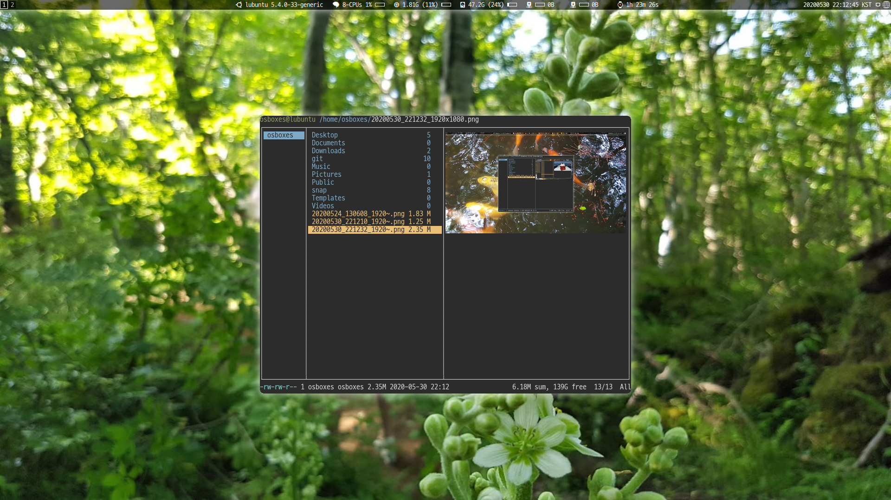
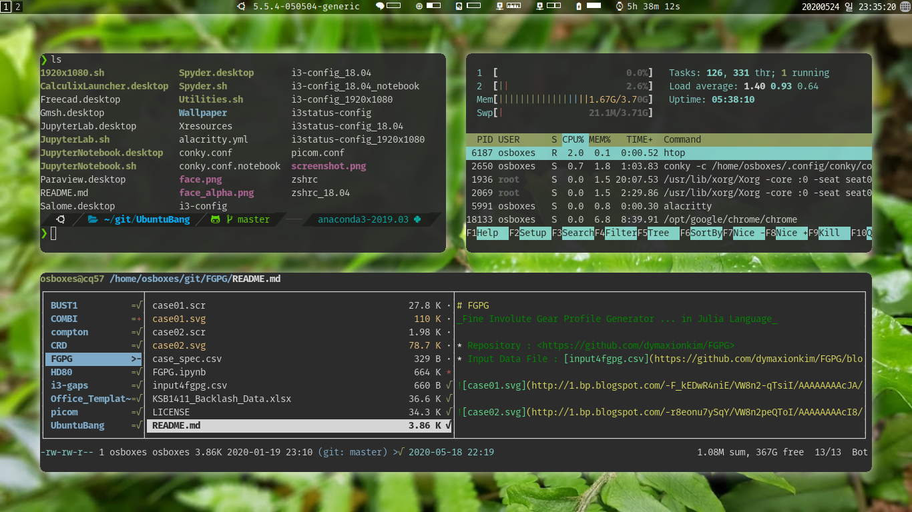

# UbuntuBang
_Build for My Ubuntu Desktop Environment using i3wm_






## OS

* Lubuntu 20.04

```bash
sudo apt -y update
sudo apt -y upgrade
```

## VirtualBox

```bash
sudo usermod -G vboxsf -a $USER
```

## UKUU 18.9.1 (for 18.04)

```bash
wget -O $HOME/Downloads/ukuu.deb https://github.com/teejee2008/ukuu/releases/download/v18.9.1/ukuu-v18.9.1-amd64.deb

sudo dpkg -i $HOME/Downloads/ukuu.deb
rm $HOME/Downloads/ukuu.deb
```

## Utilities

```bash
sudo apt -y install make build-essential feh rofi scrot qalculate convertall curl arandr screenfetch pavucontrol pasystray mupdf mupdf-tools xclip
```

## Upgrade Git

```bash
sudo add-apt-repository -y ppa:git-core/ppa
sudo apt -y update
sudo apt -y upgrade
sudo curl -s https://packagecloud.io/install/repositories/github/git-lfs/script.deb.sh | sudo bash
sudo apt -y install git-lfs

git config --global user.email "dymaxion.kim@gmail.com"
git config --global user.name "osboxes"
git config --global color.ui auto
git config --global core.editor micro
git config --global credential.helper cache
git config --global push.default matching

mkdir $HOME/git
cd git
git clone https://github.com/dymaxionkim/UbuntuBang.git
cd
```

## Wallpaper

```bash
ln -s $HOME/git/UbuntuBang/Wallpaper $HOME/.Wallpaper

sudo mv /usr/share/sddm/themes/lubuntu/theme.conf /usr/share/sddm/themes/lubuntu/theme.conf.old
sudo bash -c 'echo "background=/home/osboxes/.Wallpaper/20200411_215713.jpg" > /usr/share/sddm/themes/lubuntu/theme.conf'

sudo mv /usr/share/sddm/themes/lubuntu/wall.png /usr/share/sddm/themes/lubuntu/wall.png.old
sudo ln -s /home/osboxes/.Wallpaper/20200411_215713.jpg /usr/share/sddm/themes/lubuntu/wall.png

ln -s $HOME/git/UbuntuBang/face.png $HOME/.face.icon
```

## Crontab

```bash
echo -e "*/1 * * * * DISPLAY=:0.0 /usr/bin/feh --randomize --bg-fill /home/osboxes/.Wallpaper/*" | crontab

crontab -l
```

## Robot icons

```bash
git clone http://dymaxionkim.iptime.org:3100/dymaxionkim/ROBOT.git $HOME/Pictures/
sudo ln -s $HOME/Pictures/ROBOT/Icons_ROBOT/robot-1107_V01.png /usr/share/sddm/faces/osboxes.face.icon
```


## Fonts

```bash
sudo apt -y install language-pack-ko fonts-noto-cjk fonts-noto-cjk-extra msttcorefonts

sudo wget -O /usr/share/fonts/truetype/D2Coding.zip https://github.com/naver/d2codingfont/releases/download/VER1.3.2/D2Coding-Ver1.3.2-20180524.zip
sudo unzip /usr/share/fonts/truetype/D2Coding.zip -d /usr/share/fonts/truetype/
sudo rm /usr/share/fonts/truetype/D2Coding.zip

# https://github.com/kelvinks/D2Coding_Nerd
sudo mkdir /usr/share/fonts/truetype/D2CodingNerd
sudo wget -O /usr/share/fonts/truetype/D2CodingNerd/D2CodingNerd.ttf https://github.com/kelvinks/D2Coding_Nerd/raw/master/D2Coding%20v.1.3.2%20Nerd%20Font%20Complete.ttf

sudo mkdir /usr/share/fonts/truetype/ARIALUNI
sudo wget -O /usr/share/fonts/truetype/ARIALUNI/ARIALUNI.TTF https://raw.githubusercontent.com/dymaxionkim/CREO3_STARTUP/master/font/ARIALUNI.TTF

sudo mkdir /usr/share/fonts/truetype/BickhamScriptPro
sudo wget -O /usr/share/fonts/truetype/BickhamScriptPro/BickhamScriptPro-Bold.otf http://dymaxionkim.iptime.org:3100/dymaxionkim/ROBOT/raw/branch/master/Fonts/BickhamScriptPro-Bold.otf
sudo wget -O /usr/share/fonts/truetype/BickhamScriptPro/BickhamScriptPro-Regular.otf http://dymaxionkim.iptime.org:3100/dymaxionkim/ROBOT/raw/branch/master/Fonts/BickhamScriptPro-Regular.otf
sudo wget -O /usr/share/fonts/truetype/BickhamScriptPro/BickhamScriptPro-Semibold.otf http://dymaxionkim.iptime.org:3100/dymaxionkim/ROBOT/raw/branch/master/Fonts/BickhamScriptPro-Semibold.otf

sudo fc-cache -f -v
sudo apt -y install gnome-font-viewer
```

## IME

### - fcitx-hangul

```bash
sudo apt install fcitx-hangul
im-config -n fcitx
sudo reboot now
```

### - uim-byeoru

```bash
sudo apt install uim uim-byeoru
im-config -n uim
sudo reboot now
```

### - nimf

* Ref : https://hamonikr.org/hamoni_notice/77036

```bash
wget -O - http://apt.hamonikr.org/hamonikr.key | sudo apt-key add -
sudo bash -c "echo 'deb https://apt.hamonikr.org jin main upstream' > /etc/apt/sources.list.d/hamonikr-jin.list"
sudo bash -c "echo 'deb-src https://apt.hamonikr.org jin main upstream' >> /etc/apt/sources.list.d/hamonikr-jin.list"

sudo apt update

# 한글만 사용하고 싶은경우
sudo apt install nimf nimf-libhangul

# 일본어, 중국어 등 다른언어를 사용하고 싶은경우
sudo apt install libnimf1 nimf nimf-anthy nimf-dev nimf-libhangul nimf-m17n nimf-rime

im-config -n nimf
sudo reboot now
```

## VScode

```bash
sudo curl https://packages.microsoft.com/keys/microsoft.asc | gpg --dearmor > microsoft.gpg
sudo install -o root -g root -m 644 microsoft.gpg /etc/apt/trusted.gpg.d/
sudo sh -c 'echo "deb [arch=amd64] https://packages.microsoft.com/repos/vscode stable main" > /etc/apt/sources.list.d/vscode.list'
sudo apt -y install apt-transport-https
sudo apt -y update
sudo apt -y install code
```

## LaTeX, PanDoc

```bash
sudo apt -y install texlive-full pandoc
```

## Snap Utilities

```bash
sudo snap install micro --classic
sudo snap install gimp
sudo snap install inkscape
sudo snap install ffmpeg
sudo snap install mpv --beta
sudo snap install pdfmixtool
sudo snap install boxy-svg
sudo snap install freecad --stable
sudo snap install julia-mrcinv --edge --classic
ln -s /var/lib/snapd/desktop/applications/ $HOME/.local/share/applications/snap
ln -s $HOME/git/UbuntuBang/Freecad.desktop $HOME/.local/share/applications/Freecad.desktop
```

## Alacritty 0.4.2

```bash
wget -O $HOME/Downloads/alacritty.deb https://github.com/alacritty/alacritty/releases/download/v0.4.2/Alacritty-v0.4.2-ubuntu_18_04_amd64.deb
sudo dpkg -i $HOME/Downloads/alacritty.deb
rm $HOME/Downloads/alacritty.deb

mkdir $HOME/.config/alacritty
ln -s $HOME/git/UbuntuBang/alacritty/yml $HOME/.config/alacritty/alacritty.yml
```

## Pyenv

```bash
curl -L https://github.com/pyenv/pyenv-installer/raw/master/bin/pyenv-installer | bash

### Path Pyenv
export PATH="/home/osboxes/.pyenv/bin:$PATH"
eval "$(pyenv init -)"
eval "$(pyenv virtualenv-init -)"

### Anaconda
pyenv install anaconda3-2020.02
pyenv global anaconda3-2020.02
pyenv activate anaconda3-2020.02
conda update --all

### Icons
mkdir $HOME/.local/share/applications
ln -s $HOME/git/UbuntuBang/JupyterNotebook.desktop $HOME/.local/share/applications/JupyterNotebook.desktop
ln -s $HOME/git/UbuntuBang/JupyterLab.desktop $HOME/.local/share/applications/JupyterLab.desktop
ln -s $HOME/git/UbuntuBang/Spyder.desktop $HOME/.local/share/applications/Spyder.desktop
```

## Build i3-gaps rounded wm

```bash
sudo apt -y install libxcb1-dev libxcb-keysyms1-dev libpango1.0-dev libxcb-util0-dev libxcb-icccm4-dev libyajl-dev libstartup-notification0-dev libxcb-randr0-dev libev-dev libxcb-cursor-dev libxcb-xinerama0-dev libxcb-xkb-dev libxkbcommon-dev libxkbcommon-x11-dev autoconf libxcb-xrm0 libxcb-xrm-dev libxcb-shape0-dev automake

# clone the repository
git clone https://github.com/resloved/i3.git $HOME/git/i3-gaps
cd $HOME/git/i3-gaps
 
# compile & install
autoreconf --force --install
rm -rf build/
mkdir -p build && cd build/
 
# Disabling sanitizers is important for release versions!
# The prefix and sysconfdir are, obviously, dependent on the distribution.
../configure --prefix=/usr --sysconfdir=/etc --disable-sanitizers
make
sudo make install

# i3 config
mkdir $HOME/.config/i3
ln -s $HOME/git/UbuntuBang/i3-config $HOME/.config/i3/config

# i3status
sudo apt -y install i3status

# i3status config
mkdir $HOME/.config/i3status
ln -s $HOME/git/UbuntuBang/i3status-config $HOME/.config/i3status/config

# Terminal config
sudo apt -y install rxvt-unicode-256color
mv $HOME/.Xresources $HOME/.old
ln -s $HOME/git/UbuntuBang/Xresources $HOME/.Xresources
```

## Conky

```bash
sudo apt -y install conky-all wmctrl

mkdir $HOME/.config/conky
ln -s $HOME/git/UbuntuBang/conky.conf $HOME/.config/conky/conky.conf
```


## Build Picom (Fork of Compton compositor)

```bash
# Pre-requisites
sudo apt -y install libxext-dev libxcb1-dev libxcb-damage0-dev libxcb-xfixes0-dev libxcb-shape0-dev libxcb-render-util0-dev libxcb-render0-dev libxcb-randr0-dev libxcb-composite0-dev libxcb-image0-dev libxcb-present-dev libxcb-xinerama0-dev libxcb-glx0-dev libpixman-1-dev libdbus-1-dev libconfig-dev libgl1-mesa-dev  libpcre2-dev  libevdev-dev uthash-dev libev-dev libx11-xcb-dev asciidoc

conda install meson

# clone the repository
git clone https://github.com/yshui/picom.git $HOME/git/picom
cd $HOME/git/picom

# Build
export GIT_INTERNAL_GETTEXT_TEST_FALLBACKS=1 # if git submodule is appeared
git submodule update --init --recursive
meson --buildtype=release . build
ninja -C build

# Install
meson configure -Dprefix=$HOME/.local build
ninja -C build install

# Configure
mkdir $HOME/.config/picom
ln -s $HOME/git/UbuntuBang/picom.conf $HOME/.config/picom/picom.conf
```

## zsh

```bash
sudo apt -y install zsh
chsh -s `which zsh`

# Install oh my zsh!
curl -L https://raw.github.com/robbyrussell/oh-my-zsh/master/tools/install.sh | sh

# Install theme
git clone https://github.com/romkatv/powerlevel10k.git $HOME/.oh-my-zsh/custom/themes/powerlevel10k

# configs
mv $HOME/.zshrc $HOME/.zshrc.old
ln -s $HOME/git/UbuntuBang/zshrc $HOME/.zshrc

# Font
sudo mkdir /usr/share/fonts/truetype/MesloLGS_NF
sudo wget -O /usr/share/fonts/truetype/MesloLGS_NF/MesloLGS%20NF%20Regular.ttf https://github.com/romkatv/powerlevel10k-media/raw/master/MesloLGS%20NF%20Regular.ttf
sudo wget -O /usr/share/fonts/truetype/MesloLGS_NF/MesloLGS%20NF%20Bold.ttf https://github.com/romkatv/powerlevel10k-media/raw/master/MesloLGS%20NF%20Bold.ttf
sudo wget -O /usr/share/fonts/truetype/MesloLGS_NF/MesloLGS%20NF%20Italic.ttf https://github.com/romkatv/powerlevel10k-media/raw/master/MesloLGS%20NF%20Italic.ttf
sudo wget -O /usr/share/fonts/truetype/MesloLGS_NF/MesloLGS%20NF%20Bold%20Italic.ttf https://github.com/romkatv/powerlevel10k-media/raw/master/MesloLGS%20NF%20Bold%20Italic.ttf

sudo mkdir /usr/share/fonts/truetype/FiraMono
sudo wget -O /usr/share/fonts/truetype/FiraMono/FiraMono.zip https://github.com/ryanoasis/nerd-fonts/releases/download/v2.1.0/FiraMono.zip
sudo unzip /usr/share/fonts/truetype/FiraMono/FiraMono.zip -d /usr/share/fonts/truetype/FiraMono
sudo rm /usr/share/fonts/truetype/FiraMono/FiraMono.zip

sudo fc-cache -f -v

p10k configure
```


## Themes for QT5 and GTK+

```bash
sudo apt -y install qt5-style-plugins qt5ct
echo "export QT_QPA_PLATFORMTHEME=gtk2" >> ~/.profile
sudo bash -c 'echo "export QT_QPA_PLATFORMTHEME=gtk2" >> /etc/environment'
```

## OpenJDK 11

```bash
sudo add-apt-repository ppa:openjdk-r/ppa
sudo apt install openjdk-11-jdk
```


## Typora (Markdown Editor)

```bash
wget -qO - https://typora.io/linux/public-key.asc | sudo apt-key add -
sudo add-apt-repository 'deb https://typora.io/linux ./'
sudo apt -y update
sudo apt -y install typora
```

## Min Browser 1.14

* Download [Min Browser](https://github.com/minbrowser/min) from [here](https://github.com/minbrowser/min/releases/download/v1.14.0/min_1.14.0_amd64.deb) or :

```bash
wget -O $HOME/Downloads/min.deb https://github.com/minbrowser/min/releases/download/v1.14.0/min_1.14.0_amd64.deb
```

* Fix some code about user agent to login google : 

```bash
sudo mv /usr/lib/min/resources/app/main.build.js /usr/lib/min/resources/app/main.build.js.old

sed "s/app.userAgentFallback = newUserAgent/\/\* app.userAgentFallback = newUserAgent \*\/\napp.userAgentFallback = \'Mozilla\/5.0 \(Windows NT 10.0\; WOW64\; rv\:74.0\) Gecko\/20100101 Firefox\/74.0'/g" /usr/lib/min/resources/app/main.build.js.old | sudo tee -a /usr/lib/min/resources/app/main.build.js

```

## Ranger

* Ref : https://www.digitalocean.com/community/tutorials/installing-and-using-ranger-a-terminal-file-manager-on-a-ubuntu-vps

```bash
sudo apt install ranger caca-utils highlight atool w3m poppler-utils mediainfo
ranger --copy-config=all
```

## kakoun (Alternative of Vim)

* Source : https://github.com/mawww/kakoune
* Intro : https://medium.com/@Jernfrost/kakoune-the-text-editor-i-didnt-know-i-needed-23d5f1d6ad97

## Docker

* Ref : [How To Install and Use Docker on Ubuntu 20.04](https://www.digitalocean.com/community/tutorials/how-to-install-and-use-docker-on-ubuntu-20-04) / [Docker with GUI Tutorial](https://goodgodgd.github.io/ian-flow/archivers/docker-tutorial)

## Remove unnecessary things

```bash
sudo apt remove --purge kcalc 2048-qt k3b noblenote quassel trojita skanlite screengrab
sudo apt autoremove
```


# Engineering Tools

## ConvertAll 0.8

```bash
# https://convertall.bellz.org
# JS Online Version : http://convertall-js.bellz.org/
sudo apt remove convertall
cd ~/git
git clone https://github.com/doug-101/ConvertAll.git
cd ConvertAll
sudo ./install.py
```

## CalculiX Launcher

* Download [CalculiX Launcher](http://www.calculixforwin.com/) from [here](https://drive.google.com/drive/folders/1jb02PnNtH1u5PKrdsG_hqsZmU2eMmG6q).

* And execute the commands like that :

```bash
unzip $HOME/Downloads/CL33-linux64.zip -d $HOME/
mv $HOME/CL33-linux64 $HOME/.CalculixLauncher
ln -s $HOME/git/UbuntuBang/CalculixLauncher.desktop $HOME/.local/share/applications/CalculixLauncher.desktop
rm $HOME/Downloads/CL33-linux64.zip
  
echo "OMP_NUM_THREADS=4" > $HOME/.pam_environment
echo "export OMP_NUM_THREADS" >> $HOME/.pam_environment
```

## Gmsh 4.5.6

* Download [Gmsh](https://gmsh.info/) from here :

```bash
cd
wget -O $HOME/Downloads/gmsh.tgz https://gmsh.info/bin/Linux/gmsh-4.5.6-Linux64.tgz
```

* And execute the commands like that :

```bash
tar -xvzf $HOME/Downloads/gmsh.tgz -C $HOME/
mv $HOME/gmsh-4.5.6-Linux64 $HOME/.Gmsh
rm $HOME/Downloads/gmsh.tgz
ln -s $HOME/git/UbuntuBang/Gmsh.desktop $HOME/.local/share/applications/Gmsh.desktop
```

## Paraview

* Download [Paraview](https://www.paraview.org/) from [here](https://www.paraview.org/download/).
* And execute the commands like that :

```bash
rm -rf $HOME/.Paraview
rm -rf $HOME/.local/share/Trash/files/*
rm -rf $HOME/.local/share/Trash/info/*

tar -xvzf $HOME/Downloads/ParaView-*.tar.gz -C $HOME/
find . -name "ParaView-*" -type d -exec mv '{}' $HOME/.Paraview \;
rm $HOME/Downloads/ParaView*.tar.gz
ln -s $HOME/.Paraview/share/applications/org.paraview.ParaView.desktop $HOME/.local/share/applications/Paraview.desktop
```

## Pre-requisites for Salome and Salome_meca (20.04)

```bash
# Prerequisites
sudo apt install net-tools libtbb2 gfortran libgfortran4 bison flex liblapack-dev libopenblas-dev libboost-python-dev libboost-numpy-dev liblapack3
```

## Salome Platform 9.4 (Success in 20.04)

* Download [Salome Platform](https://www.salome-platform.org/) from [here](https://www.salome-platform.org/downloads/current-version) or :

```bash
wget -O $HOME/Downloads/salome.tgz https://www.salome-platform.org/downloads/current-version/DownloadDistr?platform=SP.UB18.04&version=9.4.0
```

* And execute the commands like that :

```bash
tar xfz salome.tgz
mv $HOME/Downloads/salome $HOME/.Salome
rm $HOME/Downloads/salome.tgz
ln -s $HOME/git/UbuntuBang/Salome.desktop $HOME/.local/share/applications/Salome.desktop
```

## Salome Meca 2019 (Success in 20.04)

* Download [Salome Meca](https://www.code-aster.org/) from [here](https://www.code-aster.org/spip.php?article303) or :

```bash
wget -O $HOME/Downloads/salome_meca-2019.0.3-1-universal.tgz https://www.code-aster.org/FICHIERS/salome_meca-2019.0.3-1-universal.tgz
```

* And execute the commands like that :

```bash
# Python 2 is needed to install
pyenv install anaconda2-2019.07
pyenv activate anaconda2-2019.07

cd $HOME/Downloads
tar -xvf salome_meca-2019.0.3-1-universal.tgz
./salome_meca-2019.0.3-1-universal.run
# Install into /home/osboxes/.Salome_meca

rm $HOME/Downloads/salome_meca-2019.0.3-1-universal*

# Dependency for CodeAster Module
# Ref : https://www.code-aster.org/forum2/viewtopic.php?id=24883
wget -O $HOME/Downloadslibffi6_3.2.1-9_amd64.deb http://ftp.br.debian.org/debian/pool/main/libf/libffi/libffi6_3.2.1-9_amd64.deb
sudo dpkg -i $HOME/Downloadslibffi6_3.2.1-9_amd64.deb
rm $HOME/Downloadslibffi6_3.2.1-9_amd64.deb

# Execute with this desktop file
ln -s $HOME/git/UbuntuBang/Salome_meca.desktop $HOME/.local/share/applications/Salome_meca.desktop
```

## ccx2paraview (frd to vtu converter)

```bash
cd ~/git
git clone https://github.com/calculix/ccx2paraview.git
```

## ElmerFEM in Docker (u18.04)

* [Docker Image for Elmer in a Desktop Environment](https://github.com/unifem/Elmer-desktop)

```bash
docker pull unifem/elmer-desktop
docker run -it unifem/elmer-desktop /bin/bash
```

